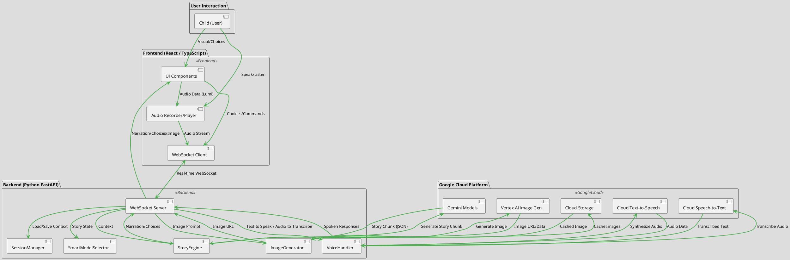

<div align="center">
  
</div>

# StoryLives: The Interactive Multimodal Storytelling Agent

## Overview
StoryLives redefines children's storytelling by transforming it into an immersive, interactive, and multimodal adventure. Powered by Google's cutting-edge Generative AI, StoryLives enables children to co-create unique narratives with Lumi, a warm and engaging AI storyteller. This application breaks the traditional text-box paradigm, allowing kids to influence the story through voice, witness real-time AI-generated illustrations, and make choices that shape their magical world. It's a "live" and context-aware experience designed to spark imagination and creativity.

## Key Features
*   **Magical Storytelling with Lumi:** Engage in dynamic, co-created stories with Lumi, an AI storyteller with a distinct, warm persona, powered by Gemini models.
*   **Real-time Illustrations:** Experience the narrative come alive with whimsical, child-friendly illustrations generated instantly for every story beat using Vertex AI Image Generation.
*   **Voice Interaction:** Speak directly to Lumi using a push-to-talk interface. Lumi responds in a narrated voice via Google Cloud Text-to-Speech, and understands child's input via Google Cloud Speech-to-Text.
*   **Context Awareness:** The story engine meticulously tracks the narrative's location, characters, and mood, ensuring a consistent and coherent experience even as the story evolves.
*   **Interactive Choices:** Guide the adventure by making choices presented at key story junctures, fostering agency and critical thinking.
*   **Atmospheric Design:** A dark, immersive UI with soft glows and smooth transitions creates a focused, magical environment conducive to storytelling.
*   **Cost Optimization:** Intelligent caching of generated images minimizes API calls and optimizes resource usage.

## Architecture
StoryLives employs a robust full-stack architecture designed for real-time multimodal interaction. The frontend, built with React, communicates with a Python FastAPI backend via WebSockets. This backend orchestrates interactions with various Google Cloud Generative AI services to deliver a "live" storytelling experience.

**Components:**
*   **Frontend (React/TypeScript/Vite):** User interface for interaction, displaying narration, images, and choices. Handles audio input/output.
*   **Backend (Python FastAPI):**
    *   **WebSocket Server:** Manages real-time communication with connected clients.
    *   **StoryEngine:** Uses Google GenAI SDK (Gemini) to generate story chunks based on context.
    *   **ImageGenerator:** Uses Vertex AI SDK for image generation (Imagen) and Google Cloud Storage for caching.
    *   **VoiceHandler:** Integrates Google Cloud Text-to-Speech and Speech-to-Text for Lumi's voice and child's input.
    *   **SessionManager:** Manages and persists story context for each user session.
    *   **SmartModelSelector:** Dynamically selects optimal AI models based on story state.
*   **Google Cloud Services:**
    *   **Gemini Models:** Core for story generation.
    *   **Vertex AI Image Generation (Imagen):** For real-time visual storytelling.
    *   **Google Cloud Storage:** For caching generated images.
    *   **Google Cloud Text-to-Speech (TTS):** For Lumi's narrated voice.
    *   **Google Cloud Speech-to-Text (STT):** For transcribing child's voice input.

### Architecture Diagram


## Tech Stack
*   **Frontend:** React, TypeScript, Vite, Framer Motion, Socket.io-client
*   **Backend:** Python, FastAPI, WebSockets, Socket.io
*   **AI Models:** Google Gemini Models (e.g., Gemini 1.5 Pro), Vertex AI Imagen
*   **Google Cloud Services:** Google Cloud Storage, Google Cloud Text-to-Speech, Google Cloud Speech-to-Text

## Setup & Installation (Local Development)

### Prerequisites
*   Node.js (for frontend)
*   Python 3.9+ (for backend)
*   Google Cloud SDK (for authentication with Google Cloud services)
*   Docker (optional, for containerized local development or deployment)

### Steps

1.  **Clone the repository:**
    ```bash
    git clone [Your Repo URL]
    cd StoryLives
    ```

2.  **Backend Setup:**
    *   Navigate to the `backend` directory: `cd backend`
    *   Create a Python virtual environment and activate it:
        ```bash
        python -m venv venv
        source venv/bin/activate  # On Windows, use `venv\Scripts\activate`
        ```
    *   Install backend dependencies:
        ```bash
        pip install -r requirements.txt
        ```
    *   **Google Cloud Authentication:** Ensure your Google Cloud credentials are set up. The easiest way is to run `gcloud auth application-default login` from your terminal.
    *   **Environment Variables:** Create a `.env` file in the `backend` directory (or ensure these are set in your environment) with:
        ```
        GEMINI_API_KEY="YOUR_GEMINI_API_KEY"
        GCP_PROJECT="YOUR_GOOGLE_CLOUD_PROJECT_ID"
        CACHE_BUCKET="YOUR_GCS_CACHE_BUCKET_NAME" # Must be globally unique
        # You might also need GOOGLE_APPLICATION_CREDENTIALS pointing to a service account key file
        ```
    *   Run the backend server:
        ```bash
        uvicorn main:app --reload --port 8000
        ```
        (Note: The backend is set to run on port 8000 by default; check `server.ts` or `vite.config.ts` if frontend expects a different port)

3.  **Frontend Setup:**
    *   Open a new terminal and navigate to the project root: `cd StoryLives`
    *   Install frontend dependencies:
        ```bash
        npm install
        ```
    *   **Environment Variables:** Create a `.env.local` file in the project root with any frontend-specific environment variables, e.g., `VITE_WEBSOCKET_URL="ws://localhost:8000/ws"`.
    *   Run the frontend application:
        ```bash
        npm run dev
        ```
    *   Open your browser to `http://localhost:5173` (or the port indicated by Vite).

## Usage
*   **Start a New Adventure:** Click the "New Adventure" button to begin.
*   **Talk to Lumi:** Hold the Microphone button to speak your choices or directions. Lumi will respond in her narrated voice.
*   **Draw:** Click the Pen icon to open the Drawing Pad and create illustrations.
*   **Make Choices:** Select from the suggested choices to guide the story's path.

## Deployment (Google Cloud Run)
For production environments, the FastAPI backend should be deployed to Google Cloud Run. This provides a serverless, scalable, and cost-effective solution.

### High-Level Deployment Steps:
1.  **Ensure Dockerfile is ready:** A `Dockerfile` is provided in the `backend/` directory.
2.  **Build and Push Docker Image:**
    ```bash
    gcloud builds submit --tag gcr.io/YOUR_GOOGLE_CLOUD_PROJECT_ID/storylives-backend ./backend
    ```
3.  **Deploy to Cloud Run:**
    ```bash
    gcloud run deploy storylives-backend \
      --image gcr.io/YOUR_GOOGLE_CLOUD_PROJECT_ID/storylives-backend \
      --platform managed \
      --region YOUR_GCP_REGION \
      --allow-unauthenticated \ # Adjust as needed
      --set-env-vars GEMINI_API_KEY="YOUR_GEMINI_API_KEY" \
      --set-env-vars GCP_PROJECT="YOUR_GOOGLE_CLOUD_PROJECT_ID" \
      --set-env-vars CACHE_BUCKET="YOUR_GCS_CACHE_BUCKET_NAME"
    ```
    (Replace placeholders like `YOUR_GOOGLE_CLOUD_PROJECT_ID`, `YOUR_GCP_REGION`, `YOUR_GEMINI_API_KEY`, `YOUR_GCS_CACHE_BUCKET_NAME` with your actual values.)
4.  **Configure Frontend:** Update the frontend's `VITE_WEBSOCKET_URL` to point to your deployed Cloud Run service URL.

## Judging Criteria Alignment (for Hackathon)
StoryLives is meticulously crafted to align with the "Gemini Live Agent Challenge" judging criteria:

*   **Innovation & Multimodal UX (40%):** Breaks the textbox, seamless "See, Hear, Speak" (Vertex AI Imagen, GC TTS/STT), distinct Lumi persona, live & context-aware experience.
*   **Technical Implementation & Agent Architecture (30%):** Robust use of Google GenAI SDK (Gemini), Vertex AI SDK, and Google Cloud SDKs for TTS/STT. Modular backend, graceful error handling, and context grounding.
*   **Mandatory Tech:** Leverages Gemini models, built with Google GenAI/Cloud SDKs, utilizes multiple Google Cloud services (Storage, Vertex AI, TTS, STT).

## Contributing
Contributions are welcome! Please feel free to open issues or pull requests.

## License
This project is licensed under the MIT License - see the `LICENSE` file for details.